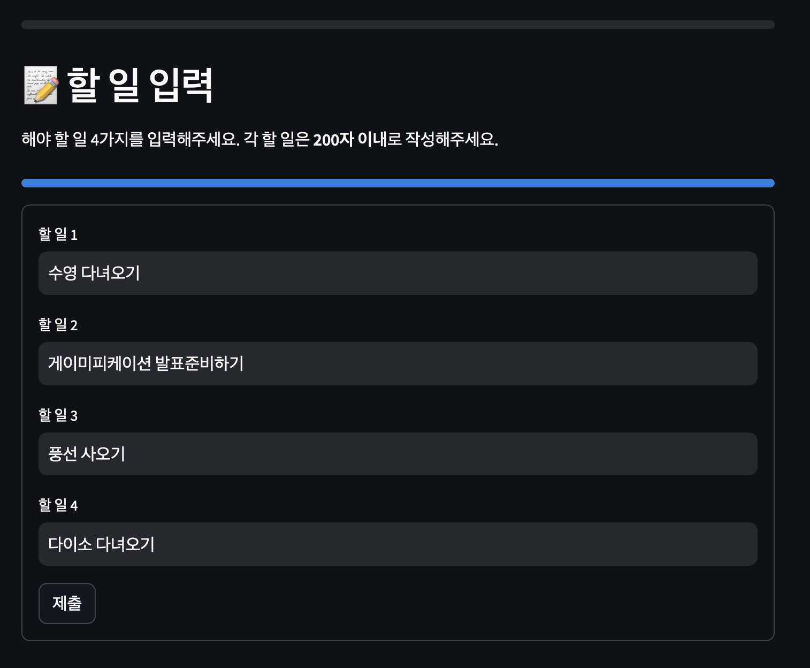
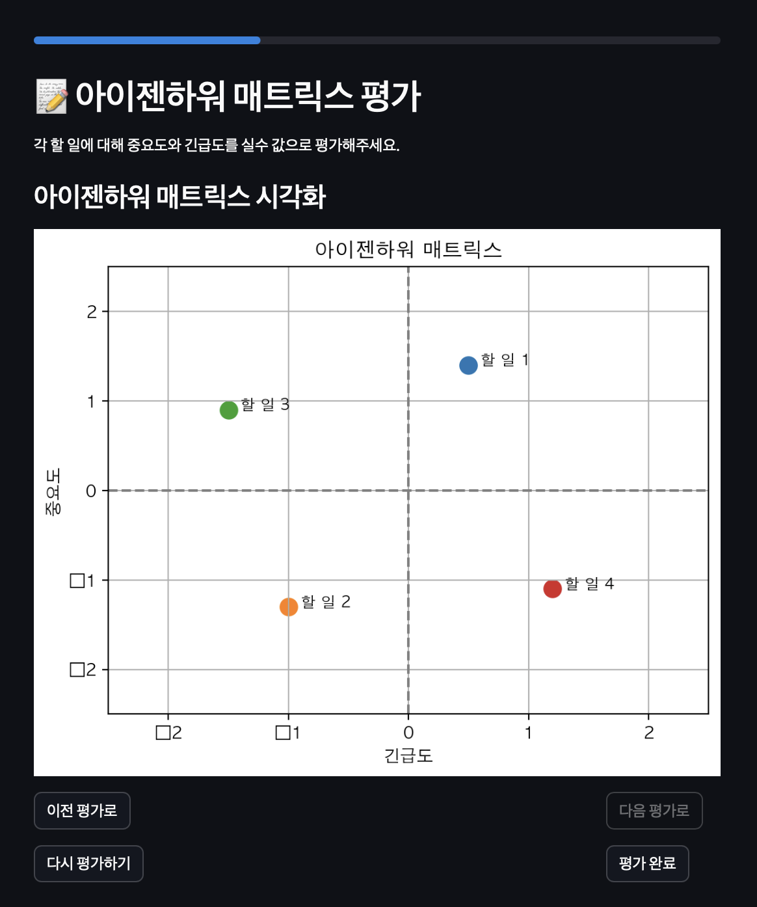

# 기록하는 행복한 습관, UPGRADE


**기록하는 행복한 습관, UPGRADE**는 사용자의 할 일 관리와 심리적 성장을 돕는 웹 애플리케이션입니다. Streamlit을 활용하여 개발된 이 프로젝트는 사용자의 효율적인 시간 관리 및 목표 달성을 돕는 다양한 기능을 제공합니다.

## 프로젝트 소개

이 프로젝트는 사용자가 할 일을 기록하고 아이젠하워 매트릭스를 기반으로 우선순위를 설정하여 투두리스트를 관리할 수 있는 웹 애플리케이션입니다. 할 일을 완료할 때마다 경험치를 얻고, 레벨이 상승하는 시스템을 도입해 지속적인 동기 부여를 제공합니다.

또한, 로딩 화면에서는 긍정적인 메시지가 랜덤으로 출력되어 사용자에게 응원의 메시지를 전달합니다.

**발표자료**: [발표 자료 링크](https://docs.google.com/presentation/d/1b25sUMsxmCrz1udENAAJWUA001vWEbM3i2w-lU1DJbc/edit?usp=sharing)

**배포된 애플리케이션**: [배포 링크](https://memoupg-5wiahzxoqkmzs2df6qshyr.streamlit.app)

## 주요 기능

1. **할 일 입력**: 사용자는 최대 4개의 할 일을 입력할 수 있습니다. 각 할 일은 200자 이내로 제한되며, 간단한 형식으로 기록 가능합니다.
2. **아이젠하워 매트릭스 평가**: 각 할 일을 중요도와 긴급도를 기준으로 평가하고, 시각적으로 나타내어 사용자가 할 일의 우선순위를 쉽게 파악할 수 있습니다.
3. **투두리스트**: 아이젠하워 매트릭스를 기반으로 할 일의 우선순위에 따라 정렬된 투두리스트를 제공합니다. 각 카테고리별로 경험치와 보상이 차등 지급됩니다.

4. **경험치와 레벨 시스템**: 할 일을 완료할 때마다 경험치를 획득하고, 다음 레벨까지 남은 경험치와 퍼센트로 현재 진행 상황을 알 수 있습니다. 레벨업 시 추가 보상도 제공됩니다.

5. **로딩 페이지**: 애플리케이션 시작 시 긍정적인 메시지와 함께 프로그레스 바가 표시되며, 사용자는 동기 부여되는 메시지를 보며 로딩을 기다릴 수 있습니다.

## 사용 기술

- **프레임워크**: [Streamlit](https://streamlit.io)
- **프로그래밍 언어**: Python
- **시각화 라이브러리**: Matplotlib
- **배포 플랫폼**: Streamlit Cloud

## 설치 방법

1. 이 저장소를 클론합니다.

   ```bash
   git clone https://github.com/yourusername/upgrade-habit.git
   cd upgrade-habit
   ```

2. 필요한 패키지를 설치합니다.

   ```bash
   pip install -r requirements.txt
   ```

3. 애플리케이션을 실행합니다.

   ```bash
   streamlit run app.py
   ```

4. 로컬에서 애플리케이션이 실행되는 것을 확인합니다.

## 스크린샷

### 할 일 입력



### 아이젠하워 매트릭스



### 투두리스트


## 기여 방법

이 프로젝트에 기여하고 싶다면, 이슈를 제출하거나 풀 리퀘스트를 통해 수정 사항을 제안할 수 있습니다. 기여는 언제나 환영입니다!

## 라이선스

이 프로젝트는 MIT 라이선스에 따라 배포됩니다. 자세한 내용은 `LICENSE` 파일을 참조하세요.
